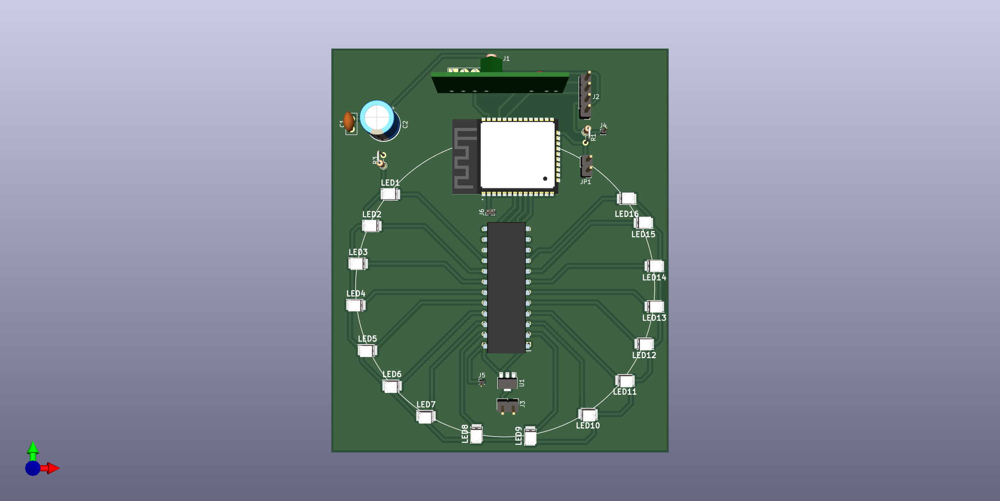
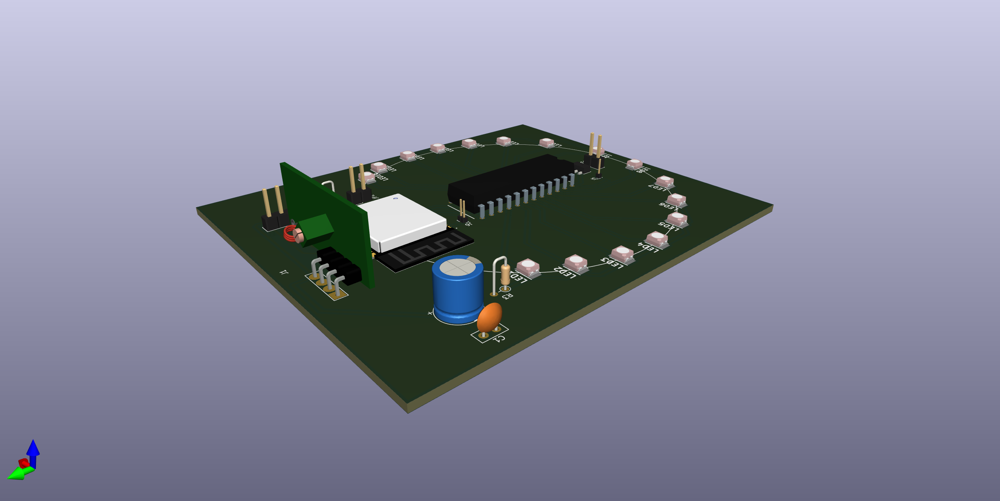

# DoorbellCamPhy
## Notifier PCB
[Schematic](NotifierPcb/Exports/NotifierPcbSchematic.pdf)

[Board](NotifierPcb/Exports/NotifierPcbBoard.pdf)

 
 
  
 
 

## Notifier PCB end result

## Camera holder
[3D Model](Holder/holderv24.stl)

 
 
  
 

## Rasperry case base
[3D Model](Base/base.stl)

 
 

## Raspberry case columns
[3D Model](Columns/column.stl)

 
 
  
 

## Raspberry case angle brackets
[3D Model](AngleBracket/angle_bracket.stl)

 
 

## Raspberry case rooftop support
[3D Model](RooftopSupport/rooftop_support.stl)

 
 

## Raspberry case IRL

 
 

